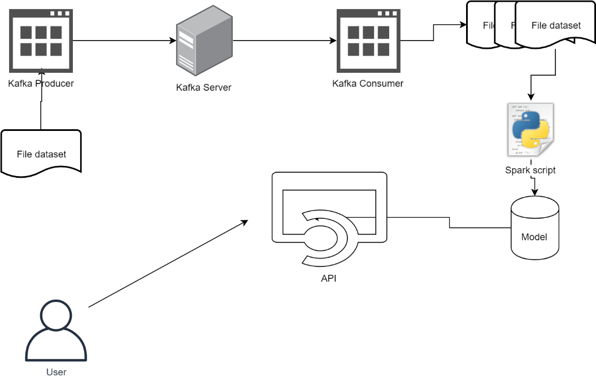
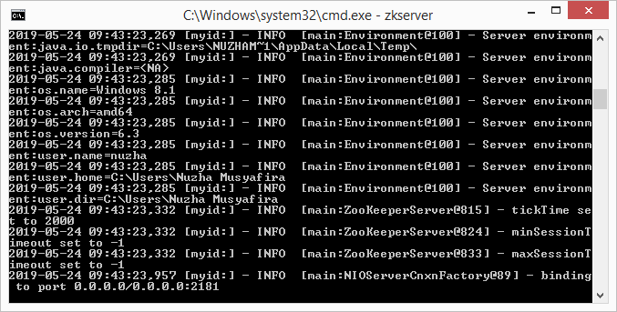
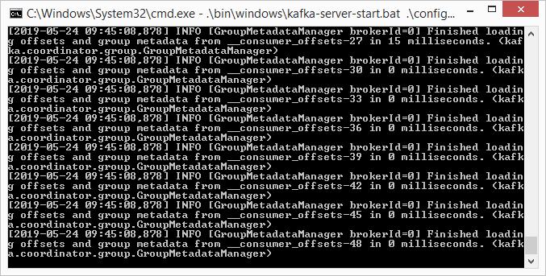
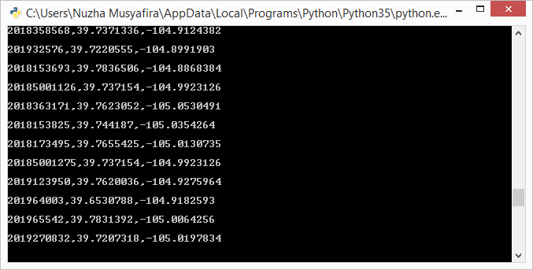
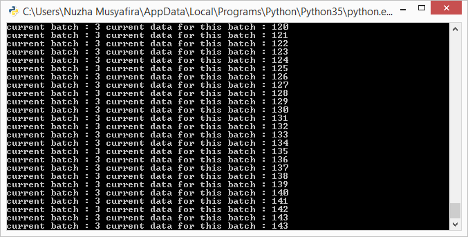
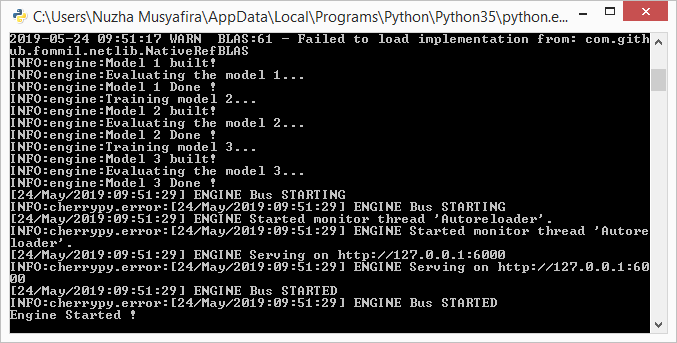
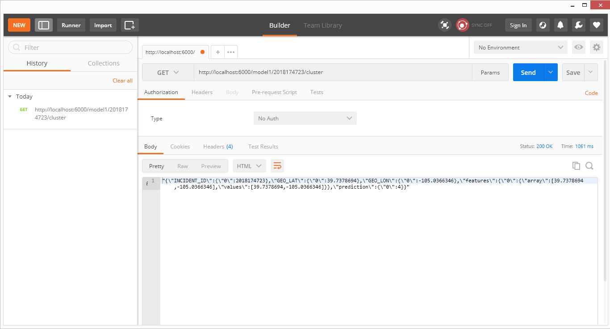
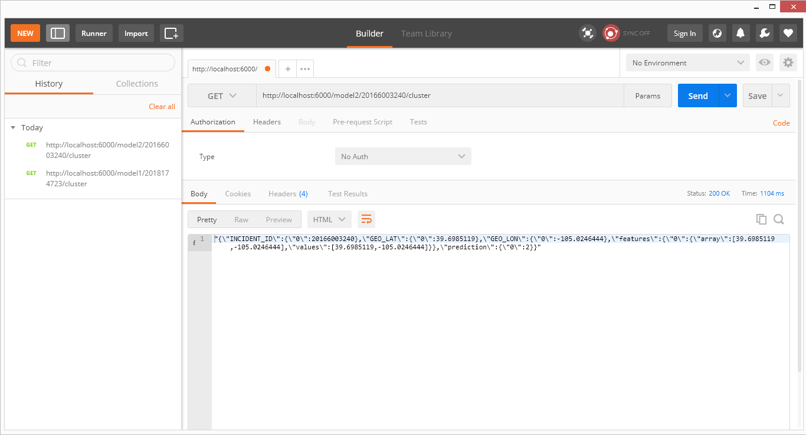
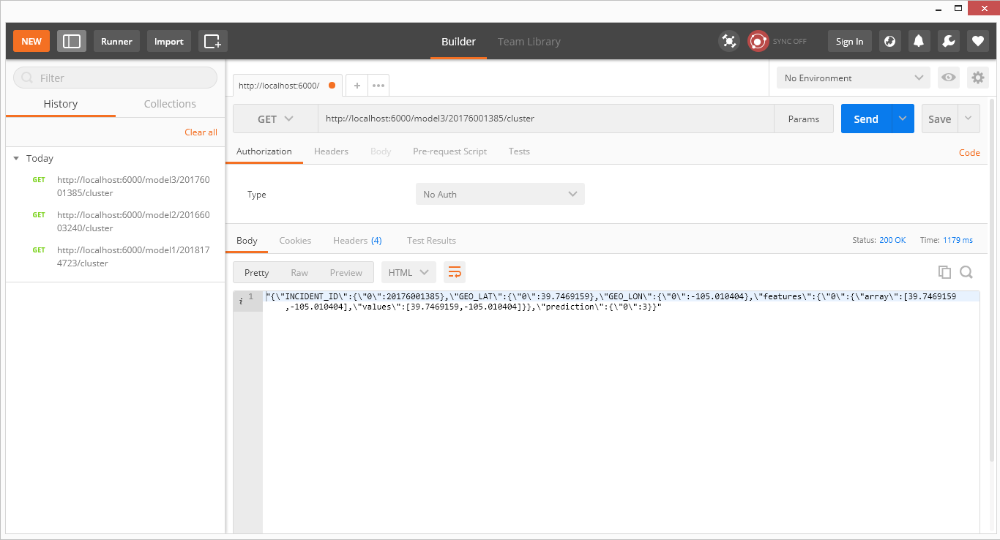

# *REST API Clustering System with Kafka*
## Deskripsi Aplikasi
Aplikasi ini merupakan *clustering engine* yang dibangun menggunakan ``Flask``. Struktur aplikasi utama terdiri dari `server.py`, `app.py`, dan `engine.py` dan menggunakan `Kafka` (`producer.py` dan `consumer.py`) untuk *data streaming*.
- `server.py` merupakan penyedia layanan dari aplikasi. `server.py` dijalankan pertama kali untuk inisiasi.
- `app.py` dipanggil oleh `server.py` saat proses inisiasi. `app.py` juga menyediakan *routing* untuk aplikasi sekaligus perantara ke `engine.py`.
- `engine.py` adalah tempat di mana *logic* atau *backend* aplikasi disimpan. Proses-proses seperti *loading dataset*, *training model*, dan algoritma ``KMeans`` diletakkan di file ini.
- `producer.py` merupakan *data fetcher* dan nantinya bertugas mengirimkan data ke `consumer.py`. Pada sistem ini, dataset yang digunakan adalah [Denver Crime](https://www.kaggle.com/paultimothymooney/denver-crime-data/downloads/denver-crime-data.zip/85) yang telah di*preprocess* sebelumnya menjadi `crime_preprocessed.csv`.
- `consumer.py` berfungsi untuk menerima data dari `producer.py` yang nantinya akan digunakan oleh `engine.py` pada saat pemrosesan data.
## Alur Aplikasi

1. Terdapat sebuah file dataset yang akan dibaca secara sekuensial oleh Kafka Producer.
2. Kafka Producer akan mengirimkan data per baris ke Kafka Server seolah-olah sedang
melakukan streaming. Proses ini dapat dilakukan dengan menambahkan jeda/sleep secara
random agar data tidak dikirimkan secara langsung.
3. Kafka consumer membaca data yang ada di dalam Kafka server dan akan menyimpan data
yang diterima dalam bentuk batch. Batch ditentukan berdasarkan jumlah data yang diterima, sehingga nanti akan didapatkan beberapa file dataset sesuai dengan batch yang dipilih.
4. Spark script bertugas untuk melakukan training model sesuai dengan data yang masuk.
Terdapat 3 model yang dihasilkan sesuai dengan jumlah data yang masuk dengan skema sebagai berikut:
   1. Model 1: Menggunakan 5000 data pertama.
   2. Model 2: Menggunakan 5000 data kedua.
   3. Model 3: Menggunakan 5000 data ketiga.
5. Model-model yang dihasilkan akan digunakan di dalam API.
## *URL* / *Endpoint*
*URL* dapat ditambah atau diubah pada file `app.py`. *URL* yang sementara dapat diakses yaitu:
- `http://<host>:<port>/model1/<int:crime_id>/cluster`
- `http://<host>:<port>/model2/<int:crime_id>/cluster`
- `http://<host>:<port>/model3/<int:crime_id>/cluster`

``host`` dan ``port`` dapat dimodifikasi pada file `server.py`. Pada aplikasi kali ini, penulis menggunakan `127.0.0.1` (`localhost`) dengan port `6000`.
## Cara Menjalankan
1. Pastikan `zookeeper`, `Kafka`, dan module lainnya telah terinstall dan dapat dijalankan.
2. Buat folder `dataset` dan letakkan *preprocessed data* di dalamnya.
3. Buat folder `dataset-kafka` untuk menyimpan model-model yang dihasilkan dari `Kafka`.
4. Jalankan `zookeeper` dengan *command* `zkserver`.

5. Jalankan `Kafka` dengan *command* `.\bin\windows\kafka-server-start.bat .\config\server.properties` pada direktori penyimpanan `Kafka`.

6. Jalankan `producer.py` dan `consumer.py` (pastikan *topic* yang dipilih telah terbentuk sebelumnya). Tunggu hingga berhasil men*generate* seluruh model.

7. Jalankan `server.py`.

## *Testing*
### 1. Mendapatkan Prediksi *Clustering* untuk *INCIDENT_ID* Tertentu pada Model 1
- *URL*: `http://<host>:<port>/model1/<crime_id>/cluster`
- Parameter:
  - ``crime_id`` -> *INCIDENT_ID* yang akan diprediksi
- Metode: `GET`
- Contoh Format: `http://localhost:6000/model1/2018174723/cluster`
- *Output* dan *Screenshot*:

### 2. Mendapatkan Prediksi *Clustering* untuk *INCIDENT_ID* Tertentu pada Model 2
- *URL*: `http://<host>:<port>/model2/<crime_id>/cluster`
- Parameter:
  - ``crime_id`` -> *INCIDENT_ID* yang akan diprediksi
- Metode: `GET`
- Contoh Format: `http://localhost:6000/model2/20166003240/cluster`
- *Output* dan *Screenshot*:

### 3. Mendapatkan Prediksi *Clustering* untuk *INCIDENT_ID* Tertentu pada Model 3
- *URL*: `http://<host>:<port>/model3/<crime_id>/cluster`
- Parameter:
  - ``crime_id`` -> *INCIDENT_ID* yang akan diprediksi
- Metode: `GET`
- Contoh Format: `http://localhost:6000/model3/20176001385/cluster`
- *Output* dan *Screenshot*:

