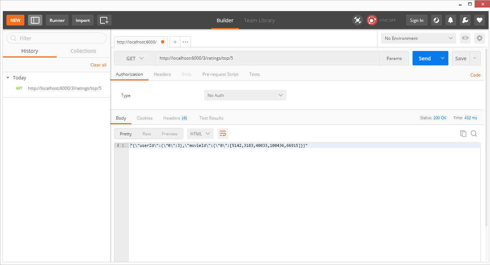
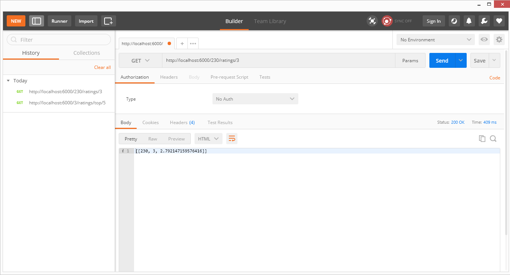
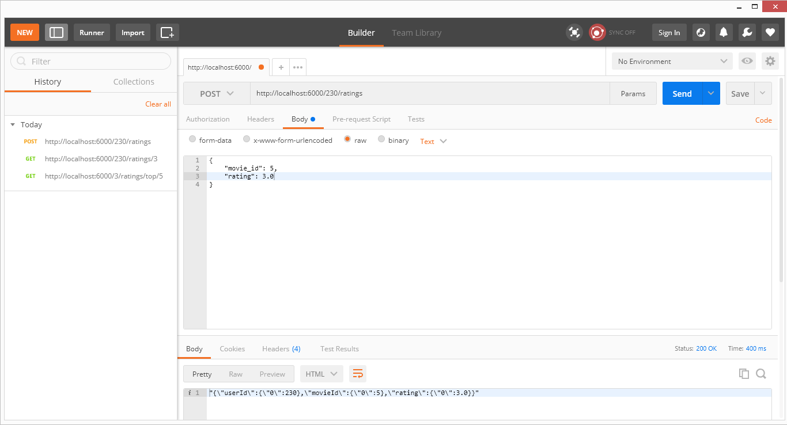

# *REST API Recommendation System*
## Deskripsi Aplikasi
Aplikasi ini merupakan *recommendation engine* yang dibangun menggunakan ``Flask``. Struktur aplikasi utama terdiri dari `server.py`, `app.py`, dan `engine.py`.
- `server.py` merupakan penyedia layanan dari aplikasi. `server.py` dijalankan pertama kali untuk inisiasi.
- `app.py` dipanggil oleh `server.py` saat proses inisiasi. `app.py` juga menyediakan *routing* untuk aplikasi sekaligus perantara ke `engine.py`
- `engine.py` adalah tempat di mana *logic* atau *backend* aplikasi disimpan. Proses-proses seperti *loading dataset*, *training model*, dan algoritma ``ALS`` diletakkan di file ini.
## *URL*
*URL* dapat ditambah atau diubah pada file `app.py`. *URL* yang sementara dapat diakses yaitu:
- `http://<host>:<port>/<int:user_id>/ratings/top/<int:count>`
- `http://<host>:<port>/<int:user_id>/ratings/<int:movie_id>`
- `http://<host>:<port>/<int:user_id>/ratings`

``host`` dan ``port`` dapat dimodifikasi pada file `server.py`. Pada aplikasi kali ini, penulis menggunakan `127.0.0.1` (`localhost`) dengan port `6000`.
## *Testing*
### 1. Mendapatkan *Top Ratings* untuk *User* Tertentu
- *URL*: `http://<host>:<port>/<user_id>/ratings/top/<count>`
- Parameter:
  - ``user_id`` -> *ID user* yang akan diberikan rekomendasi
  - ``count`` -> jumlah rekomendasi yang akan diberikan
- Metode: `GET`
- Contoh Format: `http://localhost:6000/3/ratings/top/5`
- *Output* dan *Screenshot*:


### 2. Memprediksi *Movie Rating* oleh *User* Tertentu
- *URL*: `http://<host>:<port>/<user_id>/ratings/<movie_id>`
- Parameter:
  - ``user_id`` -> *ID user* yang akan diprediksikan
  - ``movie_id`` -> *ID movie* yang akan diprediksikan
- Metode: `GET`
- Contoh Format: `http://localhost:6000/230/ratings/3`
- *Output* dan *Screenshot*:


### 3. Memberikan *Movie Rating* oleh *User* Tertentu
- *URL*: `http://<host>:<port>/<user_id>/ratings`
- Parameter:
  - ``user_id`` -> *ID user* yang akan memberikan *rating*
  - ``movie_id`` -> *ID movie* yang akan diberi *rating*
  - ``rating`` -> nilai *rating* yang akan diberikan
- Metode: `POST`
- Contoh Format: `http://localhost:6000/230/ratings`

    Karena metode yang digunakan `POST`, maka beberapa paramater dimasukkan secara manual pada *Request Body*:
  
    ```
    {
      "movie_id": 5,
      "rating": 3.0,
    }
    ```
- *Output* dan *Screenshot*:


